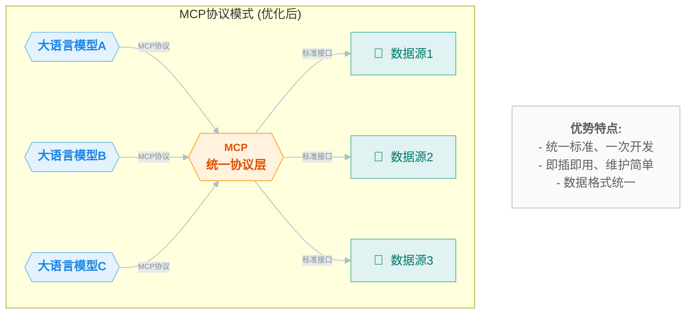

**MCP（Model Context Protocol）模型上下文协议**，听起来非常神秘，就像是TCP协议一样。大家应该都听说过他， 尤其是在Manus出来以后。
他到底是什么呢？能做什么呢？
这里我和大家一起学习一下，我们先从他能做什么开始。

# 1. 三个高德地图MCP的场景
> 以下所有场景使用的工具都是`Cursor`。
## 1.1 先从玩开始
现在的大模型LLM一定是从提示词开始的：
```markdown
【行程规划需求-**必须使用高德MCP**，不要基于你自身经验，要依据高德的结果】
# 目的地：北京
# 出行人数：2人（夫妻）
# 时间范围：4月30日晚抵达 - 5月5日（共5天4晚）
# 需求重点：
- 经典景点覆盖（故宫/长城/颐和园等必游地）
- 特色体验推荐（胡同文化/老字号美食/夜景）
- 住宿建议（优选王府井/前门等交通便利区域）
- 交通方案（机场到市区+景点间通勤）
- 人流预警（五一高峰期特别注意事项）
# 附加需求：
- 适合情侣的浪漫体验推荐
- 每日合理步行强度安排
- 考虑天气，备选雨天方案
- 可考虑1天近郊行程（如古北水镇）
# 给我详细的行程规划，包括交通方式，预计所需时间。
```
下面是`gemini-2.5`调用高德MCP服务，获取经纬度信息，和路线、时间规划的执行过程。


最后，`gemini-2.5`基于以上的相关信息，结合自己的**对任务拆解的执行步骤**输出了出行计划。

大家可以看下上图红框的部分：**它检测了自己的执行步骤是否满足我的要求**。
最后给大家看成果：

> 北京出行计划在线看：https://50hwn63pt7.app.yourware.so/

原始提示词来自于`way-to-AGI的成峰老师`，我做了一些轻微改动。
<details>
  <summary>旅行规划表设计提示词（优化版）</summary>

```markdown
# 旅行规划表设计提示词（优化版）

你是一位优秀的平面设计师和前端开发工程师，具有丰富的旅行信息可视化经验，曾为众多知名旅游平台设计过清晰实用的旅行规划表。现在需要为我创建一个A4纸张大小的旅行规划表，适合打印出来随身携带使用。请使用HTML、CSS和JavaScript代码实现以下要求：

## 基本要求

**尺寸与基础结构**

* 严格符合A4纸尺寸（210mm×297mm），比例为1:1.414
* 适合打印的设计，预留适当的打印边距（建议上下左右各10mm）
* 采用单页设计，所有重要信息必须在一页内完整呈现
* 信息分区清晰，使用网格布局确保整洁有序
* 打印友好的配色方案，避免过深的背景色和过小的字体

**技术实现**

* 使用打印友好的CSS设计
* 提供专用的打印按钮，优化打印样式
* 使用高对比度的配色方案，确保打印后清晰可读
* 可选择性地添加虚线辅助剪裁线
* 使用Google Fonts或其他CDN加载适合的现代字体
* 引用Font Awesome提供图标支持

**专业设计技巧**

* 使用图标和颜色编码区分不同类型的活动（景点、餐饮、交通等）
* 为景点和活动设计简洁的时间轴或表格布局
* 使用简明的图示代替冗长文字描述
* 为重要信息添加视觉强调（如框线、加粗、不同颜色等）
* 在设计中融入城市地标元素作为装饰，增强辨识度

## 设计风格

* **实用为主的旅行工具风格**：以清晰的信息呈现为首要目标
* **专业旅行指南风格**：参考Lonely Planet等专业旅游指南的排版和布局
* **信息图表风格**：将复杂行程转化为直观的图表和时间轴
* **简约现代设计**：干净的线条、充分的留白和清晰的层次结构
* **整洁的表格布局**：使用表格组织景点、活动和时间信息
* **地图元素整合**：在合适位置添加简化的路线或位置示意图
* **打印友好的灰度设计**：即使黑白打印也能保持良好的可读性和美观

## 内容区块

1.  **行程标题区**：
    * 目的地名称（主标题，醒目位置）
    * 旅行日期和总天数
    * 旅行者姓名/团队名称（可选）
    * 天气信息摘要
2.  **行程概览区**：
    * 按日期分区的行程简表
    * 每天主要活动/景点的概览
    * 使用图标标识不同类型的活动
3.  **详细时间表区**：
    * 以表格或时间轴形式呈现详细行程
    * 包含时间、地点、活动描述
    * 每个景点的停留时间
    * 标注门票价格和必要预订信息
    * **明确要求：在两个不同景点之间，补充交通方式及所需时间**
4.  **交通信息区**：
    * 主要交通换乘点及方式
    * 地铁/公交线路和站点信息
    * 预计交通时间
    * 使用箭头或连线表示行程路线
5.  **住宿与餐饮区**：
    * 酒店/住宿地址和联系方式
    * 入住和退房时间
    * 推荐餐厅列表（标注特色菜和价格区间）
    * 附近便利设施（如超市、药店等）
6.  **实用信息区**：
    * 紧急联系电话
    * 重要提示和注意事项
    * 预算摘要
    * 行李清单提醒

## 示例内容（基于上海一日游）

**目的地**：上海一日游

**日期**：2025年3月30日（星期日）

**天气**：阴，13°C/7°C，东风1-3级

**时间表**：

| 时间 | 活动 | 地点 | 详情 |
| --- | --- | --- | --- |
| 09:00-11:00 | 游览豫园 | 福佑路168号 | 门票：40元 |
| 11:00-11:30 | 交通：地铁10号线 | 豫园站 到 老西门站 | 大约30分钟 |
| 11:30-12:30 | 城隍庙午餐 | 城隍庙商圈 | 推荐：南翔小笼包 |
| 12:30-13:30 | 交通：地铁14号线 | 老西门站 到 陆家嘴站 | 大约25分钟 |
| 13:30-15:00 | 参观东方明珠 | 世纪大道1号 | 门票：80元起 |
| 15:00-15:30 | 交通：步行 | 东方明珠 到 陆家嘴金融区 | 大约30分钟 |
| 15:30-17:30 | 漫步陆家嘴 | 陆家嘴金融区 | 免费活动 |
| 17:30-18:30 | 交通：地铁2号线转11号线 | 陆家嘴站 到 迪士尼站 | 大约1小时 |
| 18:30-21:00 | 迪士尼小镇或黄浦江夜游 | 详见备注 | 夜游票：120元 |

**交通路线**：

* 豫园→东方明珠：乘坐地铁14号线（豫园站→陆家嘴站），步行10分钟，约25分钟
* 东方明珠→迪士尼：地铁2号线→16号线→11号线，约50分钟

**实用提示**：

* 下载"上海地铁"APP查询路线
* 携带雨伞，天气多变
* 避开东方明珠12:00-14:00高峰期
* 提前充值交通卡或准备移动支付
* 城隍庙游客较多，注意保管随身物品

**重要电话**：

* 旅游咨询：021-12301
* 紧急求助：110（警察）/120（急救）

请创建一个既美观又实用的旅行规划表，适合打印在A4纸上随身携带，帮助用户清晰掌握行程安排。
```
</details>

## 1.2 找附近的饭店/咖啡店/奶茶店.....
点子来自于产品黄叔。
```markdown
我家在通州耿庄桥北，我有朋友要过来吃饭，请帮我找一个距离我家比较近，评分也相对比较好的饭店，吃烧烤。
```

试想一下，假设这个时候，我再加一个大众点评的MCP服务。
**是不是就是一个全新的Manus。**

## 1.3 实际业务场景--以信贷风控环节为例
>**信用保证保险（信贷）也是类似的场景**。

2023年和2024年，其实陆续做过两个需求。
**需求内容**：移动端通过高德SDK获取经纬度，海拔等相关信息，上传到后端，然后由后端进行风控预警。当时这个两个需求从需求分析到上线，基本都差不多用了三周时间。
但是如果现在用**大模型+MCP+工作流**方案实现，可能一天就能完成了。
下面我给大家演示一下，还是从提示词开始：

```markdown
# 任务
评估贷款审批风险，综合考虑客户提供的地址信息和定位信息。
# 背景数据
* **单位地址**：北京市朝阳区联合大厦13层
* **家庭地址**：北京市通州区荔景园2号楼
* **客户端第一次定位信息**：
    ```json
    {
      "location": {
        "longitude": "116.43228604918505",
        "latitude": "39.9214788108844",
        "altitude": "40.29402104765177",
        "levelAccuracy": "34.41631",
        "verticalAccuracy": "0.0"
      }
    }
    
* **客户端第二次定位信息**：
    ```json
    {
      "location": {
        "longitude": "116.43228604918505",
        "latitude": "39.9214788108844",
        "altitude": "40.29402104765177",
        "levelAccuracy": "34.41631",
        "verticalAccuracy": "0.0"
      }
    }
```
# 需求内容
1.  **地址距离评估**：
    * 计算并返回单位地址的经纬度 (`unitLng`, `unitLat`)。
    * 计算并返回家庭地址的经纬度 (`homeLng`, `homeLat`)。
    * 判断单位地址和家庭地址之间的距离是否在 50km 以内 (`isWithin50km`)。
2.  **定位距离评估**：
    * 计算当前核保定位地址与单位地址的距离 (`unitDistance`)。
    * 计算当前核保定位地址与家庭地址的距离 (`homeDistance`)。
3.  **定位一致性评估**：
    * 判断客户端第一次和第二次上报的定位信息是否一致 (`isConsistent`)。
# 输出格式要求
严格按照 JSON 格式输出结果。
# 输出格式示例
```json
{
  "unitLng": 116.4074,
  "unitLat": 39.9042,
  "homeLng": 121.4737,
  "homeLat": 31.2304,
  "isWithin50km": true,
  "unitDistance": 15.3,
  "homeDistance": 42.8,
  "isConsistent": false
}
​```
```

看模型实现过程：
 
 

 在这里，大家想一下，假设**coze或者dify等工作流平台支持MCP**，我们是不是通过拖拉拽，基本上就可以完成这个需求。

​```mermaid
graph LR
    A[信贷审批系统定时调用] --> B[触发工作流]
    C -->|根据结果| D[自动给出风险提示]
    C -->|根据结果| E[不给出风险提示]

    subgraph "coze/dify 工作流"
        B1[提交地址信息等原始数据] --> B2[LLM 调用高德地图 MCP 服务]
        B2 --> B3[LLM 输出整理好的 JSON 格式结果]
        B3 --> B4[HTTP 请求]
        B4 -->|成功| B5[成功结束]
        B4 -->|不成功| B6[定时再次重试]
        B6 --> B5
    end
    
    B --> B1
    B5 --> C
    
    %% 样式美化
    classDef default fill:#f9f9f9,stroke:#333,stroke-width:2px;
    classDef workflow fill:#e6f3ff,stroke:#0066cc,stroke-width:2px;
    classDef system fill:#fff3e6,stroke:#ff6600,stroke-width:2px;
    classDef success fill:#e6ffe6,stroke:#00cc00,stroke-width:2px;
    classDef retry fill:#fff0f0,stroke:#cc0000,stroke-width:2px;
    
    class A,B,C system;
    class B1,B2,B3,B4,B5 workflow;
    class B6 retry;
    class D,E success;
```

# 2. 以上场景的提前准备工作
## 2.1MCP协议的作用
那么MCP协议到底是什么呢。其实我理解看来，就是类似于改变了一个模式。
原来的对接模式是这样子的：

大家其实能看出来，使用成本很高。
​```mermaid
graph LR
    subgraph "传统模式 (优化后)"
        direction LR
        LLM1{{大语言模型A}}
        LLM2{{大语言模型B}}
        LLM3{{大语言模型C}}

        DS1[<span style='font-size:18px; margin-right: 5px;'>💾</span> 数据源1]
        DS2[<span style='font-size:18px; margin-right: 5px;'>💾</span> 数据源2]
        DS3[<span style='font-size:18px; margin-right: 5px;'>💾</span> 数据源3]

        %% LLM 到 DS 的连接线 (共 9 条)
        LLM1 -- "专用接口 1" --> DS1
        LLM1 -- "专用接口 2" --> DS2
        LLM1 -- "专用接口 3" --> DS3
        LLM2 -- "专用接口 4" --> DS1
        LLM2 -- "专用接口 5" --> DS2
        LLM2 -- "专用接口 6" --> DS3
        LLM3 -- "专用接口 7" --> DS1
        LLM3 -- "专用接口 8" --> DS2
        LLM3 -- "专用接口 9" --> DS3
    end

    %% 注释节点定义
    note1[<div style='padding:5px;'><strong>问题痛点:</strong><br>- 重复开发、标准不一<br>- 维护成本高昂<br>- 系统集成复杂<br>- 数据格式混乱</div>]

    %% --- 使用不可见连接线将 note1 定位到右侧 ---
    %% 将 note1 连接到右侧的 DS2 (或其他右侧节点)
    %% 使用 ~~~ 或 --- 作为连接符
    DS2 ~~~ note1

    %% --- 样式定义 ---

    %% 节点样式
    classDef llmStyle fill:#E3F2FD,stroke:#64B5F6,stroke-width:1px,color:#1E88E5,font-weight:bold,border-radius:8px
    classDef dsStyle fill:#E0F2F1,stroke:#4DB6AC,stroke-width:1px,color:#00796B,border-radius:8px
    classDef noteStyle fill:#FAFAFA,stroke:#BDBDBD,stroke-width:1px,color:#616161,border-radius:4px

    %% 应用样式
    class LLM1,LLM2,LLM3 llmStyle
    class DS1,DS2,DS3 dsStyle
    class note1 noteStyle

    %% 主要连接线样式 (LLM <-> DS)
    %% linkStyle 0,1,2,3,4,5,6,7,8 stroke:#B0BEC5,stroke-width:1px,color:#78909C,font-size:10px
    %% 或者使用 default 设置所有，再单独覆盖不可见链接
    linkStyle default stroke:#B0BEC5,stroke-width:1px,color:#78909C,font-size:10px

    %% 设置用于定位的隐藏连接线样式 (第 10 条线，索引为 9)
    linkStyle 9 stroke-width:0px
```

而如果使用MCP协议就会变成这样，是不是可以极大地降低使用成本。

在我的理解来说，**MCP协议就好像一个中间服务，它定义了LLM和数据源或者说各种工具的交互方式**。


## 2.2MCP协议的简要说明
现在MCP服务其实分为两种：
> - **Stdio**：主要用在本地服务上，操作你本地的软件或者本地的文件，比如 Blender 。
> - **SSE** ：SSE（Server-Sent Events，服务器发送事件），主要用在远程服务上，这个服务本身就有在线的 API，比如我们刚刚试的高德地图的MCP服务。
## 2.3 高德地图的MCP获取
这里参考成峰老师的步骤：
> https://waytoagi.feishu.cn/wiki/FEgvwGO9giVp72kWEsxckE1Qnte


主要是登录高德地图开放平台（`https://console.amap.com/dev/key/app`），创建APIkey。
添加key时，最重要的是一定要选择**web服务**，其他都是任意写。

个人使用的话，少量的是免费的，理论上应该够我们实验了。
## 2.4 Cursor的配置流程
依图操作即可。

点击`Add new global MCP server`后，会打开`mcp.json`文件。输入以下代码（记得将你的key替换一下）：
```json
{    "mcpServers": {        
        "amap-amap-sse": 
        { 
        "url":"https://mcp.amap.com/sse?key=这里这里！！！粘贴您在高德官网上申请的key"      
        }    
     }
}
```
我们是SSE方式，所以需要配置一个url。
接下来，我们就可以开始实验了。
如果你已经过了试用期，且不是会员，那么我们可以使用`gimini2.5`进行实验。用我最开始给大家演示的案例即可。

# 3. 不同平台对比

| 对比项           | Cursor | Cherry studio    | windsurf | Chatwise |
| ---------------- | ------ | ---------------- | -------- | -------- |
| 免费版本是否可用 | 可用   | 可用             | 不可用   | 不可用   |
| 配置是否方便     | 方便   | 方便             | 未测试   | 未测试   |
| 使用是否稳定     | 稳定   | 1.1.17版本不稳定 | 未测试   | 未测试   |

## 3.1Cherry配置过程的一些坑
配置方便排序：
`Cherry studio >  Cursor`
但是我配置的时候，
`Cherry studio`花费的时间比`Cursor`多三倍。
主要原因是，1.1.17版本的Cherry有问题，环境配置非常麻烦。


尤其是这个bun环境。多次莫名原因失败，虽然最后成功了，但是也不知道怎么成功的，苦笑.jpg。所以这里不知道有什么经验可以介绍给大家。

> `Cherry studio`官方配置说明：https://docs.cherry-ai.com/advanced-basic/mcp

失败多次的主要原因可能和`Cherry studio`官方配置说明中的：
> Cherry Studio 目前只使用内置的 uv 和 bun，不会复用系统中已经安装的 uv 和 bun。

有关系。最后我是使用了它下方说明中的，将系统中的exe文件复制到对应
> Windows:` C:\Users\用户名\.cherrystudio\bin`

才成功的。最新已经更新到了1.1.18版本，不知道这个配置问题是否依然存在。

配置成功后，我们在对话框设置好以下两个内容就可以开始使用了：


## 3.2 SSE连接断开问题
**`Cherry studio`断开的表现：**

这个时候，我们需要点击开关，关掉，然后**重新连接**。
**`Cursor`断开的表现：**


这里我考虑，这个**MCP的远程SSE连接**，可能是个**长链接**，服务端为了保证高效，会做一些类似心跳检测的东西，如果长时间没有使用，就会主动断掉服务（尤其是cherry studio，经常被关）。
从官网还有我目前接触的情况来看，**MCP目前貌似还不支持随用随关的短连接模式**。


还有个问题就是不知道为什么`gimini-2.5-pro-exp-0325`在cherry studio不能用，但是在Cursor可以使用。我估计也跟客户端是有关系的。


参考：
> - *逗哥，https://mcp.so/zh*
> -  *waytoagi，成峰老师。*
> - *AI产品黄叔*
