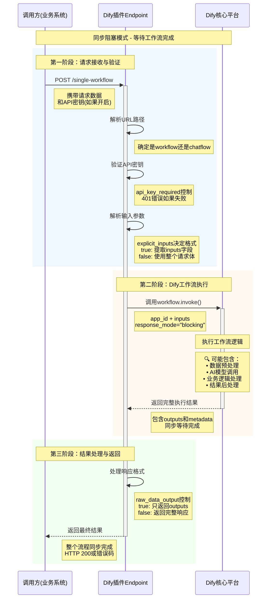

**不知道大家怎么落地大模型的。我现在完全都是从小事出发，因为搞业务，业务难搞。所以先把自己解放出来**。

就比如，我比较烦一件事情，每次流程要求，需求评审之前必须发需求评审邮件，我挺烦这件事情，虽然那内容不复杂，但是每次都要自己写，从需求管理平台里面复制名字，链接，还要写评审时间，按照格式填充邮件模板，然后找抄送人发送人。

我就寻思让大模型给我干了。但是大模型又不知道我是什么需求，每次我给他打出来，那还不是很复杂吗。没必要啊。

所以就有了今天这个事儿。

我就用`Dify`搞了一下。

当然，**自己解放出来就有更多时间思考业务，就比如这次这个事儿，完全可以复用用在很多其他场景**，比如我要到时间了自动给客户发送一个个性的生日祝福，每次开发个`http`请求，调用官方`api`多麻烦啊。

`dify`又没有触发器，那还能咋整，我们自己想办法呗。

还有个点就是，我是真服了。**网上那么多教程啊，文档啊，那都是给懂技术的老师写的，像我们这种，那是真难啊**，要是没了AI，我想搞成这个事儿那是不可能的。

不多说废话了，我们开始哈。

这个文章有点长，我想记录下这个插件的使用方式，配置项是怎么用的，一个方式方便自己记录，另一个是希望大家不要跟我自己一样，研究这个插件的使用方式研究了一整天。


## 评审邮件


开始我是搞了一个`chatflow`版本，寻思这告诉她需求名字，让他去需求平台查。需求平台有个MCP服务（腾讯的`Tapd`）。然后告诉他评审时间啊各种东西。只是省了一个需求连接、涉及哪些系统需要评审的查询，还有一个邮件的编辑时间。但是我就寻思着，我等这个，其实也挺费时间啊。

后来我就发现了`Tapd`有个自动化工具，里面还能进行`webhook`通知，我就寻思，哎，好像有点办法了。因为我经常使用企微知道企微有个机器人，都是使用webhook对接的，也就是可以通过这个发送消息。然后我还见到过`dify`的市场里面也有个这东西。


我就寻思，这两个玩意儿是不是可以联动呢？


可以，很棒。当然，谈到这里，我觉得，有必要和大家说下我的学习过程。

## 什么是webhook

我其实一直之前就把`webhook`这东西，当做一个信号接收器，别人发给我，然后我去干点啥。它的原理啥的我就当做了一个类似`kafka`的东西，哈哈，这么说`kafka`就复杂了是不是。因为我是产品，接触`kafka`比较多。

现在学东西方便太多了，我让AI给我解释下：


和我理解的差不多。

但是在深入问一下，其实**webhook也是有请求等待时间限制**的.

就是说，我给你打了电话，我等你58s，你不接我就挂电话，认为你根本没有给我任何响应。但是实际上，我看到你的电话了，我知道是要干啥活，我就立马去干了，就是没干完，所以没接你电话，等我干完了接电话的时候，你挂电话了。


所以由于这个原因，咱开始不懂技术啊，后来碰到了坑，好在想到了办法解决。

## webhook插件使用说明

这里，其实我是把这个开源项目的代码给到了`gemini`和`trae`，详细分析了解，再结合postman测试出来的。当然大家，其实知道怎么用就行了，不需要太多研究，我深入研究完全是因为第一次搞得时候，本地环境出了问题，所以没办法，被迫研究。

### 插件调用时序（不感兴趣可以跳过哈）



所以说，**这种调用模式，其余系统来调用的时候，由于webhook比较耗时，必然会超时报错**。

### webhook插件前端的配置说明

先说明，下面有很大的AI成分，但是都是经过我验证的，所以可以放心使用。


我其实最开始看的一脸懵，这都干啥的。但是这些东西对于开发老师来说估计就比较简单了，我这里写的详细点，针对我们这种小白的。

#### 配置项1：输入格式

| 状态 | 前端显示 | 请求示例 | 使用场景 |
|------|----------|----------|----------|
| ✅ true | ☑️ 使用使用 req.body.inputs 代替 req.body 作为输入对象 | `{"inputs": {"city": "北京"}}` | 生产环境、标准化 |
| ❌ false | ☐ 使用 req.body.inputs 代替 req.body 作为输入对象 | `{"city": "北京"}` | 开发测试、快速集成 |

#### 配置项2：JSON字符串化

| 状态 | 前端显示 | 实际效果 | 使用场景 |
|------|----------|----------|----------|
| ✅ true | ☑️ 将req.body转换为req.body.json_string作为JSON字符串 | `{"json_string": "原始JSON字符串"}` | 特殊系统对接、数据审计 |
| ❌ false | ☐ 将req.body转换为req.body.json_string作为JSON字符串 | 保持原始JSON结构 | 正常使用、性能优先 |

#### 配置项3：输出格式

| 状态 | 前端显示 | 响应示例 | 使用场景 |
|------|----------|----------|----------|
| ✅ true | ☑️ 发送 res.body.data 作为工作流响应，而不是 res.body | `{"weather": "晴天"}` | 前端展示、API调用 |
| ❌ false | ☐ 发送 res.body.data 作为工作流响应，而不是 res.body | `{"code": 200, "data": {...}}` | 调试分析、日志记录 |

#### 配置项4：选择"X-API-Key 头"（推荐）
**就像：** 进小区刷门禁卡（安全，别人看不到）

**请求示例：**
```
POST http://localhost:5002/single-workflow
Headers:
  X-API-Key: 你的密钥123456
  Content-Type: application/json
```


#### 配置项5：选择"URL 查询参数 'difyToken'"

**就像：** 进小区大声报密码（不安全，别人能听到）

**请求示例：**

```
POST http://localhost:5002/single-workflow?difyToken=你的密钥123456
```


#### ❌ 选择"无"

**就像：** 进小区不需要任何验证（最不安全，谁都能进）

**小白理解：**

- X-API-Key 头：密钥藏在请求头里，别人看不到 ✅
- URL参数：密钥写在网址里，谁都能看到 ❌  
- 无：不需要密钥，谁都能访问 ❌❌❌
- **生产环境务必选择 X-API-Key 头！**

#### API断点说明


这里百分百我手打的。

```json
http://localhost/e/d8pkywj80cub9w4p/workflow/<app_id> 
http://localhost/e/d8pkywj80cub9w4p/chatflow/<app_id>
http://localhost/e/d8pkywj80cub9w4p/single-chatflow
http://localhost/e/d8pkywj80cub9w4p/single-workflow
```

12和分别是通用的workflow和chatflow端点，意思就是，如果没有输入参数格式的差别，我们可以不设置其他内容，后面加上应用的id就能全部通用。应用的id就是打开一个应用后他的网址中app和workflow中间的东西。

> http://localhost/app/820f52a2-1de0-4a6a-8e97-775185821d4e/workflow

3和4，就是你设置的时，选择的那个应用的唯一webhook地址。


## Tapd-webhook调用

### 配置说明

上面说起来非常的枯燥，这里结合实际案例给大家说。

看tapd官方的说明，很明显看起来就不是上面输入格式要求中的标准格式，所以：

**将req.body转换为req.body.json_string作为JSON字符串---这一项我们要选择False**


再看，他确实是一个json结构的字符串，所以：

**将req.body转换为req.body.json_string作为JSON字符串--我们要选择True**。

另外因为我们是后端调用，且还是测试阶段，所以可以选择：

**将req.body转换为req.body.json_string作为JSON字符串---False**

**秘钥选择--无**。

##  webhook调试过程

最开始为了验证webhook的使用方式，我请教了开发老师一次，得到了一个思路，先从简单的做起。

所以我配置了这个工作流：


在这里经过多次postman测试，搞明白了，这个inputs里面的key-value是什么。

如果**使用 req.body.inputs 代替 req.body 作为输入对象**，选择了true，那么`inputs`里面每个key-value都会变成是`dify`开始节点的参数。

如果选择了false，那么我们在开始节点只需要准备一个参数，这样请求时推送的值，就会都变成这个参数的参数值。


## 工作流

所以结合上面所有的信息，我们得到了这样的工作流：


关于代码节点的代码，我们可以继续使用上篇文章中的代码节点提示词生成。

[醒醒！AI编程工具压根不是给程序员的，而是给每一个想“偷懒”的你](https://mp.weixin.qq.com/s/3kQvtZbS7pm07yQZ_e8MUg)

LLM节点的提示词就更简单了，就是根据解析`json`出来的关键信息直接按照预设好的html模板生成邮件即可。

### 本地调试

本地其实本来调试的很好，已经通了。但是出现了新的问题，就是`postman`，每次都要等待几十秒钟才能获取到结果。


那这样，这东西要是给tapd使用，那必然会请求超时啊。

而且虽然超时了，但是**实际上我把活干了**，这就是我干了活，还讨不到好，那咋能行呢。

所以我就寻思，**我能不能异步干活呢？就是我收到消息就告诉他我收到了，然后我在干活。**

我就搞了一个新的工作流，在里面建立了一个http发post请求，请求我这个邮件生成的工作流，但是不行啊，这不就回到老路，跟我在本地使用`postman`一样了？

所以就在这里左思右想怎么办，最后在`dify`的插件市场发现了这个插件。


问题迎刃而解，我可以这么搞了：


就是我让他来接收`tapd`发送的webhook消息，然后让这个工作流给我的邮件生成发送一个webhook，让它异步干活，这里呢，我又设置了超时时间是1s，所以我不会等他干完再回复`tapd`，1s之后，我就回复`tapd`了。

这样，`tapd`收到的是成功的消息，而我也把活干了，皆大欢喜。


就**相当于是A给B打电话，b接住了，然后B立马告诉C，干活了快去干，但是B不等C回消息说他知道了，B就当你知道了，然后B挂断电话给A说，我通知了**。


### 网络问题

上面不知道大家有没有注意到我的webhook地址，是一个非常奇怪的URL地址。

搞出来这个的原因就是，因为用tapd实际访问的时候，告诉我网络不通。

后来和AI讨论了下，它说因为我这是在docker里面部署的，本地是localhost的域名，但是公网并不知道我这个域名是什么，所以需要搞一个公网映射。还告诉了我方法，这个极其简单，可以不多赘述。

**Ngrok使用方法**：

**打开 ngrok 官网**：https://ngrok.com/download


在命令行启动：


拼链接的时候这样操作：

URL：https://ardell-appealable-halfheartedly.ngrok-free.dev/e/0dggij5q9ekyx7l2/single-workflow

## 结束

这篇文章到这里就结束了。

我jio着，你按照我的教程操作不出意外的话，应该是没什么问题能搞完的。

**官方文档写的都太技术了，AI时代，这些文档都应该更新一波**。对我们普通人友好一点。

说到这里，我是真的很喜欢智普的API文档。清晰易懂，就算我看不懂，AI也能看懂。


那有了上面这个webhook，我们能做什么。

比如：

**本地有个数据库，里面都是客户信息，你要给客户发送个性化的生日祝福**。


这个最后输出的是一个网址，打开就是个性化的生日祝福网页。

比如：

**你搞了一个收集每天新闻的，需要定时触发，是不是也可以呢**？

说到底，**就是`dify`应该有一个触发器的模块，包括这个插件，也应该优化下，这个异步干活，应该是可选项**。

期望大家用到更多场景。
